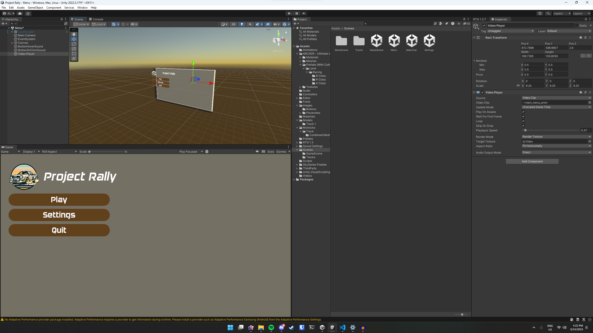
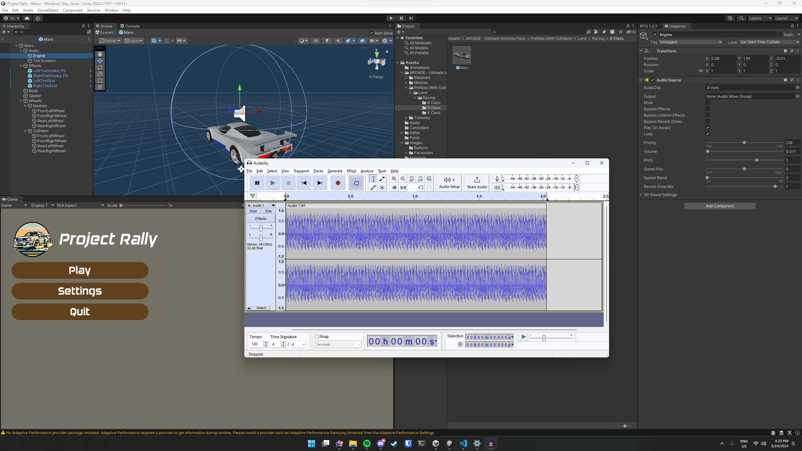
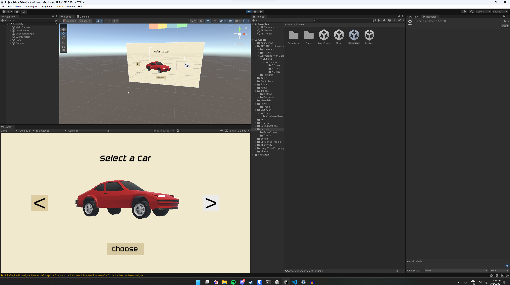
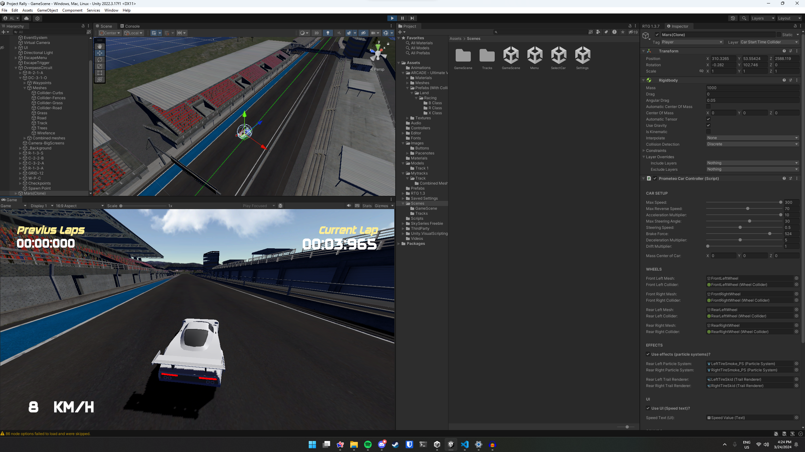

# Project Rally

## Webová Prezentace

- [Github Repo](https://github.com/Ortieez/ProjectRallyWeb)
- [Website URL](https://project-rally-web.vercel.app)

## Gameplay Video

- [Youtube Unlisted Video](https://youtu.be/caJbYnX3zP4)

## Screenshots

## Popis

- Project Rally je 3D závodní hra, která se odehrává v polootevřeném světě. (namodelované tratě)
- Hra je určena pro PC.
- Hráči si budou moct vybrat z několika vozidel, které se liší v rychlosti, ovladatelnosti a dalších vlastnostech.
- Každé z vozidel má své vlastní zvuky.
- Hráč může svůj best lap nahrát do DB, kde se následně zobrazí v tabulce mezi ostatními hráči

## Technologie

- Hra bude vytvořena v Unity.
- Pro modelování budou použity programy Blender, či další případně jednodušší programy.
- Pro tvorbu zvuků budou použity FL Studio, LMMS, či další případně jednodušší programy a [Engine Simulátoru](https://www.engine-sim.parts/).
- Pro tvorbu textur budou použity programy Photoshop/Illustrator se školní licencí.

## Tým

- Adam Lipert
- Maxmilián Dao

## Zdroje

- [Unity](https://unity.com/)
- [Blender](https://www.blender.org/)
- [FL Studio](https://www.image-line.com/flstudio/)
- [LMMS](https://lmms.io/)
- [Engine Simulátor](https://www.engine-sim.parts/)
- [Photoshop](https://www.adobe.com/products/photoshop.html)
- [Illustrator](https://www.adobe.com/products/illustrator.html)
- [Unity Asset Store](https://assetstore.unity.com/)
- [Unity Learn](https://learn.unity.com/)
